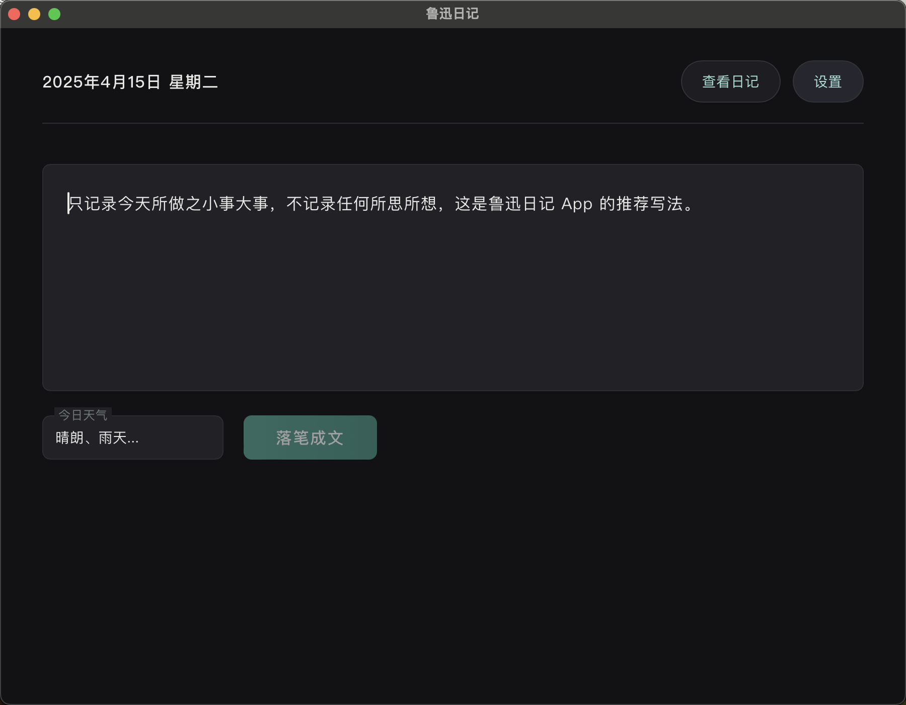

# 鲁迅日记 (Lu Xun's Diary)

一个基于 Tauri、Preact 和 TypeScript 的桌面应用，用于记录每天的日记。

## 应用构想

这是一个现代化的日记应用，灵感来自于中国文学巨匠鲁迅的日记风格。主要特点：

- **简约界面**：专注于写作体验，没有干扰的元素
- **日期管理**：按日期整理和查看日记内容
- **Nostr集成**：支持使用 Nostr 协议进行加密和分享(todo)
- **多主题**：支持明亮和黑暗模式，适应不同环境
- **隐私保护**：使用 Nostr公钥加密确保日记内容的安全性

## 记录原则

- **重视日常记录**：鼓励记载每天发生的大小事件，形成完整的生活记录
- **避免零散想法**：反对记载零碎的想法和观点，因为日记是记录个人真实的生活，而不是表达思想和观点
- **每日一记**：每天只能记录一次，培养规律的日记习惯
- **随机展示**：记录完日记后会随机展示一篇鲁迅先生的日记，增加趣味性

## TODO

- [x] 增加分享单条日记给某个 Nostr 用户功能
- [x] 增加更多文学日记：苏轼、徐霞客
- [ ] 更新数据库结构，年/月/日键值对

## Common Diaries

This application includes a feature that allows loading famous diaries (such as Lu Xun's diary, Xu Xiake's travels, and Su Dongpo's writings) from external JSON files. This approach allows you to add new diaries without rebuilding the application, keeping the app size small and making it more flexible.

### How to Use Common Diaries

1. Format your diary data according to the Common Diary specification (see `common-diary/common-diary.md`)
2. Save your file as a JSON file (e.g., `luxun-diary.json`)
3. Place the file in the common diaries directory:
   - **Windows**: `%APPDATA%\com.luxun.diary\common_diaries\`
   - **macOS**: `~/Library/Application Support/com.luxun.diary/common_diaries/`
   - **Linux**: `~/.local/share/com.luxun.diary/common_diaries/`

Example files can be found in the `common-diary` directory of the project.

## 技术栈

- **前端**：Preact + TypeScript + Vite
- **桌面支持**：Tauri (Rust)

## Recommended IDE Setup

- [VS Code](https://code.visualstudio.com/) + [Tauri](https://marketplace.visualstudio.com/items?itemName=tauri-apps.tauri-vscode) + [rust-analyzer](https://marketplace.visualstudio.com/items?itemName=rust-lang.rust-analyzer)

## Nostr 加密分享功能

应用使用 Nostr 的 NIP-59 Gift Wrap 标准实现了加密日记分享功能。这允许您安全地与朋友私密分享特定的日记条目，确保只有指定的接收方可以阅读内容。

### 实现细节

加密分享功能在后端使用 nostr-sdk Rust 库实现，遵循以下 Nostr 协议标准：

- **NIP-59 Gift Wrap**: 将日记内容封装在加密的"礼品包装"中
- **NIP-44 加密**: 提供端到端的安全加密
- **NIP-04/NIP-17**: 用于私密消息交换

加密过程包含三个主要步骤：
1. 将日记条目转换为未签名的 Nostr 事件（称为"rumor"）
2. 使用发送者的私钥加密并签名这个事件（称为"seal"）
3. 使用一次性密钥将已加密内容再次封装，并包含接收者的公钥（称为"gift wrap"）

### 如何使用

1. 在查看已完成的日记条目时，点击"加密分享日记"按钮
2. 输入接收方的 Nostr 公钥（十六进制格式）
3. 点击"创建 Gift Wrap"按钮
4. 选择一个 Nostr 中继服务器 URL（默认为 `wss://relay.damus.io/`）
5. 点击"分享到中继"按钮

接收方可以使用兼容 NIP-59 的 Nostr 客户端打开您的加密日记。

## 数据格式

应用使用统一的 Common Diary 格式存储日记数据。详细格式说明请参阅 [Common Diary 文档](./common-diary/README.md)。
